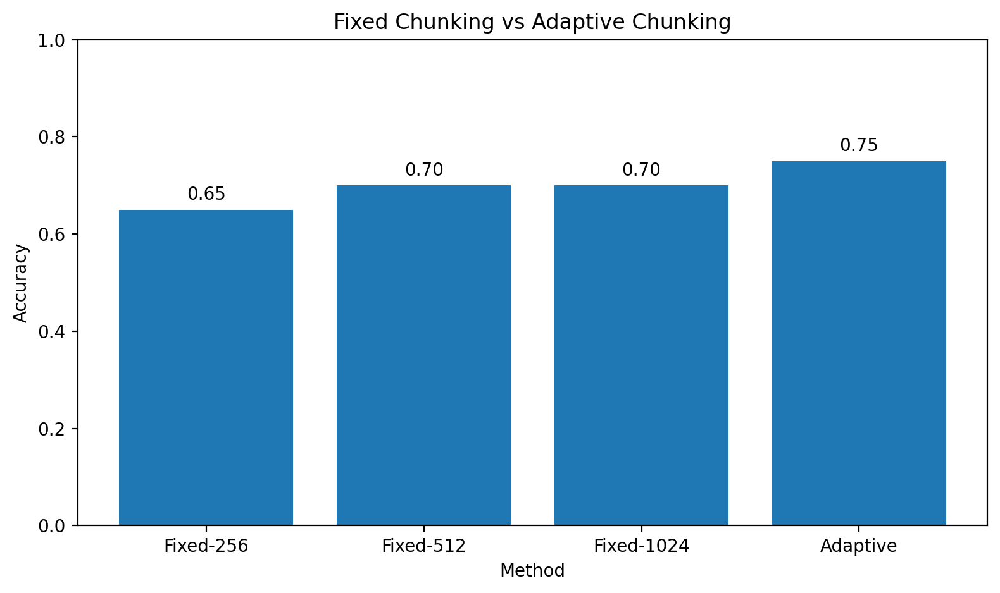
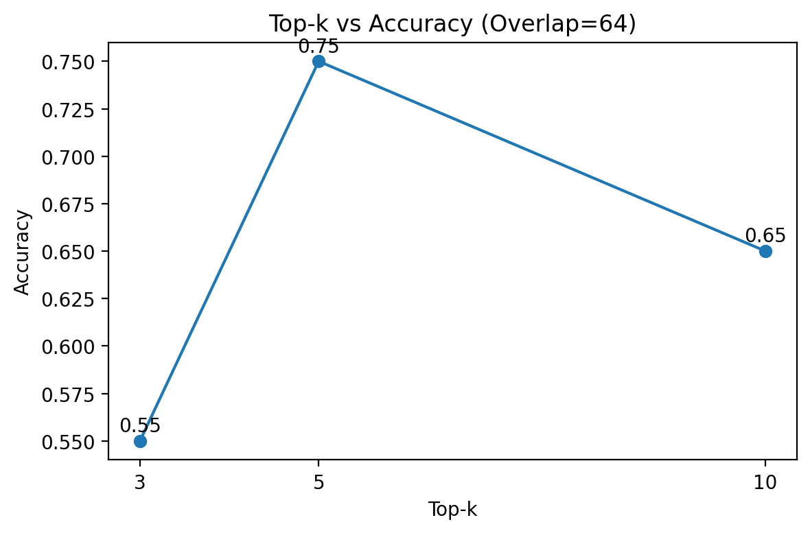
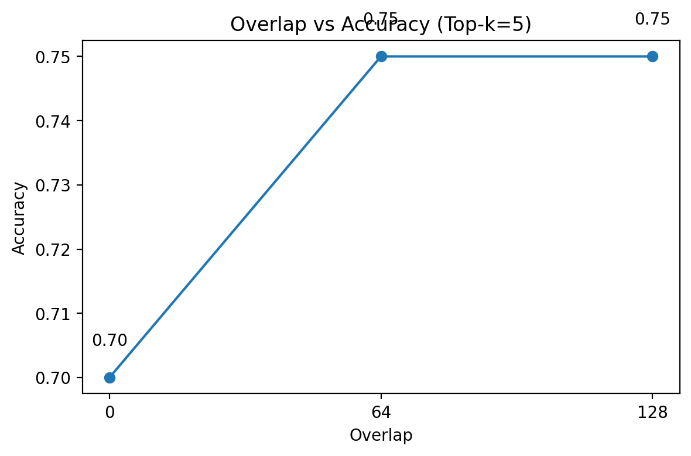
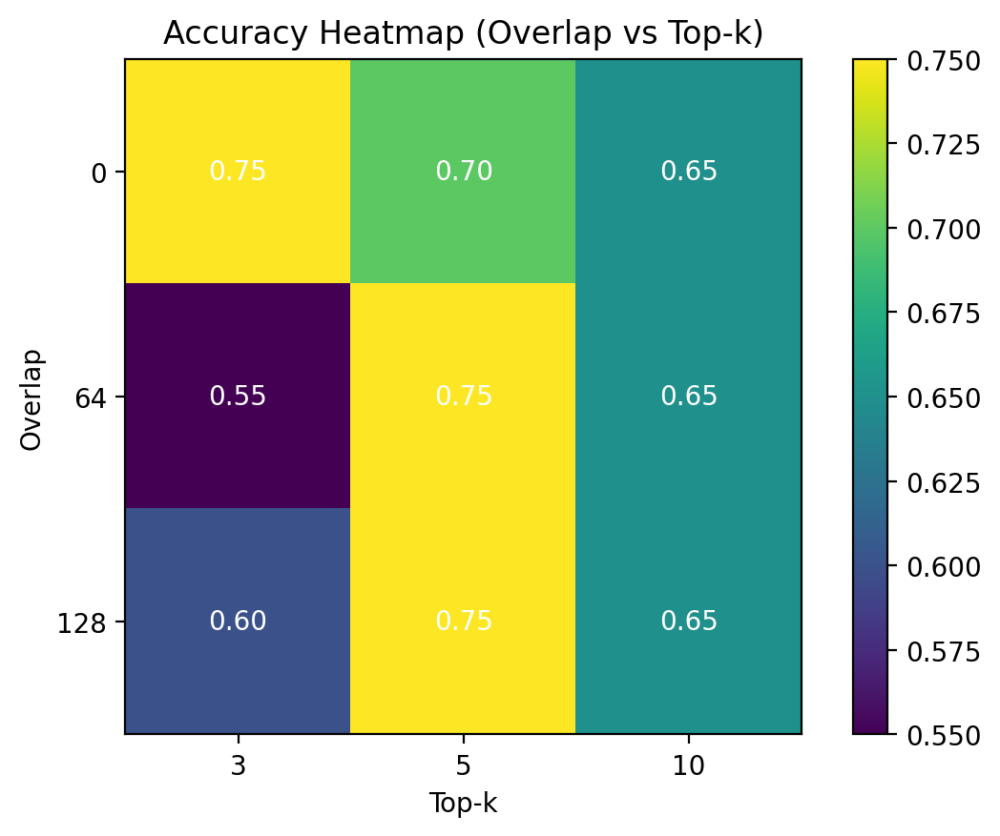

# Policy RAG Study: Retrieval, Chunking, and Error Decomposition in Policy QA

## 1. Introduction

Large Language Models (LLMs) have demonstrated strong performance in general question answering tasks. However, they often struggle with rule-based reasoning tasks such as policy eligibility determination, where strict conditions, thresholds, and exceptions must be applied accurately.

This study investigates whether Retrieval-Augmented Generation (RAG) can improve performance on policy-based QA tasks and analyzes how retrieval configurations and reasoning processes affect overall performance.

The key research questions are:

- Does RAG improve policy QA accuracy compared to vanilla LLM?
- How does chunk size affect retrieval performance?
- What are the main sources of error in policy QA systems?
- How do retrieval and reasoning interact in policy QA tasks?
- To what extent can reasoning improvements mitigate remaining errors?

---

## 2. Method

### 2.1 Task Definition

The task is to determine policy eligibility based on a given policy document.

Each question requires a final decision among:

- `yes`
- `no`
- `selection_required`

---

### 2.2 Dataset

- Source: policy.docx (소상공인 정책자금 문서)
- Questions: 20 manually created questions
- Gold answers: manually verified

Each question is designed to test:

- threshold conditions
- exception rules
- multi-condition reasoning
- program track selection

The current benchmark does not include chunk-level annotations (e.g., mapping each question to a specific rule chunk).  
Therefore, retrieval recall metrics based on correct_rule_chunk_id are not used in the final quantitative analysis.

---

### 2.3 Models and Setup

- LLM: gpt-4o-mini  
- Embedding: text-embedding-3-small  
- Vector DB: FAISS  
- Retrieval: top-k = 5  
- Temperature: 0  

---

### 2.4 Compared Methods

1. **Vanilla LLM**
   - No retrieval

2. **RAG (Fixed Chunk Size)**
   - Chunk sizes: 256 / 512 / 1024

3. **Adaptive RAG**
   - Chunk size is dynamically selected based on question type (e.g., threshold vs exception), allowing different retrieval granularity depending on task complexity.

---

## 3. Results

### 3.1 Vanilla vs RAG

**Table 1. Vanilla vs RAG Performance**

| Method | Accuracy |
|--------|--------|
| Vanilla LLM | 0.60 |
| RAG (512) | 0.75 |

This indicates that RAG significantly improves performance.  
RAG improves accuracy from 0.60 to 0.75 (+15% absolute improvement).

---

### 3.2 Chunk Size Comparison

**Table 2. Chunk Size vs Accuracy**

| Chunk Size | Accuracy |
|------------|--------|
| 256 | 0.65 |
| 512 | 0.70 |
| 1024 | 0.70 |

- Small chunks (256): insufficient context  
- Large chunks (1024): noisy retrieval  
- Medium chunks (512): best trade-off between context coverage and noise

This suggests that chunk size directly affects downstream answer accuracy.

---

### 3.3 Adaptive Retrieval

**Table 3. Fixed vs Adaptive Retrieval Accuracy**

| Method | Accuracy |
|--------|--------|
| Fixed (best=512) | 0.70 |
| Adaptive | **0.75** |

**Figure 1. Fixed vs Adaptive Retrieval Performance**

These results suggest that adaptive chunking can improve performance in some cases.
Adaptive retrieval achieves performance comparable to the best fixed configurations,
suggesting that dynamic chunking can match carefully tuned static settings.

While adaptive retrieval may provide slight improvements in some cases,
its performance is generally comparable to the best fixed configuration.

The primary findings of this study focus on the interaction between retrieval configuration and reasoning errors.

**Key Insight:**  
Retrieval granularity should be question-dependent.

---

### 3.4 Effect of Top-k Retrieval

**Table 4. Top-k vs Accuracy**

| Top-k | Accuracy (Overlap=64) |
|------|--------|
| 3 | 0.55 |
| 5 | 0.75 |
| 10 | 0.65 |

**Figure X. Top-k vs Accuracy (Overlap=64)**

The top-k results show that performance is sensitive to retrieval depth.
At overlap=64, accuracy increases from 0.55 at top-k=3 to 0.75 at top-k=5, but drops to 0.65 at top-k=10.

This suggests that retrieving too few chunks may miss important policy conditions, while retrieving too many chunks can introduce irrelevant context and reduce answer accuracy.
Overall, top-k=5 provides the most stable balance between context coverage and noise.

---

### 3.5 Effect of Chunk Overlap

**Table 5. Overlap vs Accuracy**

| Overlap | Accuracy (Top-k=5) |
|--------|--------|
| 0 | 0.70 |
| 64 | 0.75 |
| 128 | 0.75 |

**Figure Y. Overlap vs Accuracy (Top-k=5)**

The effect of overlap is positive but not strictly monotonic across all settings.
At top-k=5, introducing overlap improves accuracy from 0.70 to 0.75, while increasing overlap from 64 to 128 does not provide additional gains.

This suggests that moderate overlap helps preserve rule continuity across chunk boundaries, but excessive overlap may offer limited benefit once sufficient context is already retrieved.

---

### 3.6 Joint Effect of Top-k and Overlap

**Table 6. Joint Effect of Top-k and Overlap**

| Overlap \ Top-k | 3 | 5 | 10 |
|----------------|---|---|----|
| 0 | 0.75 | 0.70 | 0.65 |
| 64 | 0.55 | 0.75 | 0.65 |
| 128 | 0.60 | 0.75 | 0.65 |

**Figure Z. Accuracy Heatmap Across Overlap and Top-k Settings**

The heatmap shows that retrieval performance depends on the interaction between overlap and top-k rather than on either factor alone.
The strongest and most stable results appear around top-k=5, where both overlap=64 and overlap=128 achieve 0.75 accuracy.

Interestingly, overlap does not consistently improve performance at all retrieval depths.
For example, overlap=0 performs best when top-k=3, while larger overlap values are more effective when top-k=5.
This indicates that overlap should not be treated as a universally beneficial parameter; instead, its effect depends on retrieval depth.

Overall, the results suggest that top-k appears to be a more stable factor than overlap in this setting,
while overlap provides additional gains when combined with appropriate retrieval depth.

---

### 3.7 Effect of Chain-of-Thought Prompting

**Table 7. Effect of CoT Prompting**

| Setting | Accuracy |
|--------|--------|
| Baseline (top-k=5, overlap=64) | 0.75 |
| + CoT | 0.85 |

Applying Chain-of-Thought prompting leads to an improvement in accuracy.
However, this improvement does not fully eliminate errors, as reasoning failures still remain.

This suggests that while structured prompting can enhance decision consistency,
it does not completely solve the underlying challenges of rule-based reasoning.

---

## 4. Error Analysis

Errors are primarily distributed across reasoning and normalization failures,
rather than retrieval failures.

---

### 4.1 Initial Observation

Initial automatic evaluation suggested that many errors were due to retrieval failure.  
However, after correcting the evaluation pipeline, most errors were reclassified as reasoning or normalization failures.

---

### 4.2 Manual Verification

**Table 8. Error Type Count (RAG, overlap=64, top-k=5)**

| Type | Count |
|------|------|
| reasoning failure | 3 |
| normalization failure | 2 |

Some cases contained correct rules in retrieved context, but the model failed to apply them correctly.

This indicates that these errors are not caused by retrieval failure.  
This further indicates that even when correct evidence is retrieved, LLMs often fail to apply deterministic rules correctly.

---

### 4.3 Improved Error Classification

We redefine error types as:

- `reasoning_failure`
- `normalization_failure`
- `(retrieval-related errors are excluded due to lack of chunk-level annotations)`

Errors are distributed across multiple categories, showing that retrieval is not the dominant failure source.

---

## 5. Discussion

### 5.1 Nature of Policy QA

Policy QA differs from general QA in that it requires strict rule application, including threshold conditions and exception handling, rather than semantic understanding alone.

---

### 5.2 Retrieval is Not the Only Bottleneck

Most remaining errors are not caused by retrieval failure,
but by incorrect rule application or ambiguous answer generation.

---

### 5.3 Importance of Answer Normalization

Some failures arise from incorrect mapping of answers to structured outputs.

Normalization errors highlight the gap between free-form generation and structured decision tasks.

---

### 5.4 Retrieval–Reasoning Interaction

While retrieval optimization significantly improves performance, it does not fully eliminate errors.  
This suggests that policy QA performance depends on both retrieval quality and reasoning capability.

---

## 6. Conclusion

This study demonstrates that:

1. RAG significantly improves policy QA performance  
2. Chunk size, top-k, and overlap critically affect retrieval  
3. Adaptive retrieval further improves accuracy  
4. Errors are not solely caused by retrieval failure  
5. Reasoning and normalization are major bottlenecks  

**Final Insight:**  
Policy QA performance depends on the interaction between retrieval, reasoning, and answer formatting, rather than retrieval alone.

---

## 7. Future Work

- Semantic rule-based retrieval  
- LLM-based evaluation methods  
- Question-type classification models  
- Structured reasoning for policy rules  

---