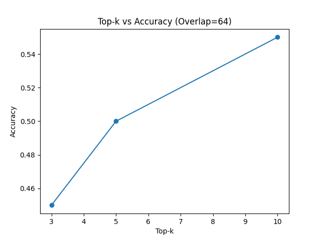
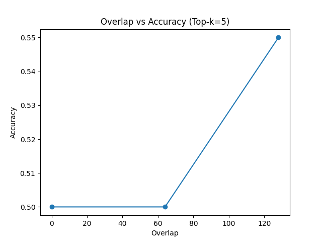
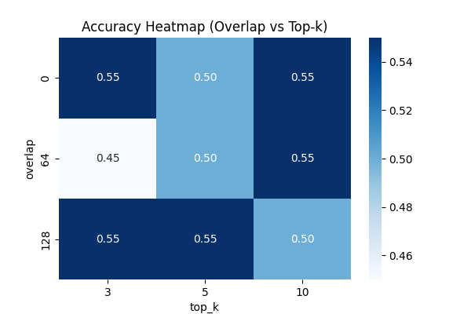
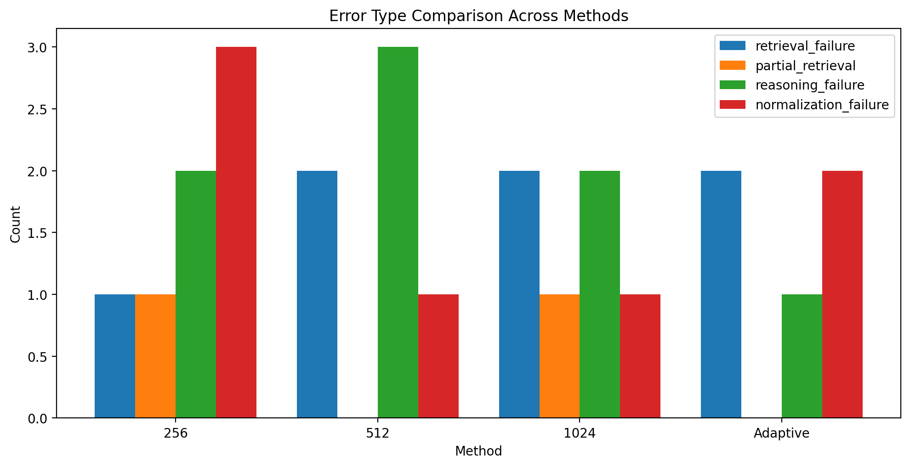

# Policy RAG Study: Retrieval, Chunking, and Error Decomposition in Policy QA

## 1. Introduction

Large Language Models (LLMs) have demonstrated strong performance in general question answering tasks. However, they often struggle with rule-based reasoning tasks such as policy eligibility determination, where strict conditions, thresholds, and exceptions must be applied accurately.

This study investigates whether Retrieval-Augmented Generation (RAG) can improve performance on policy-based QA tasks and analyzes how retrieval configurations and reasoning processes affect overall performance.

The key research questions are:

- Does RAG improve policy QA accuracy compared to vanilla LLM?
- How does chunk size affect retrieval performance?
- What are the main sources of error in policy QA systems?
- How do retrieval and reasoning interact in policy QA tasks?
- To what extent can reasoning improvements mitigate remaining errors?

---

## 2. Method

### 2.1 Task Definition

The task is to determine policy eligibility based on a given policy document.

Each question requires a final decision among:

- `yes`
- `no`
- `selection_required`

---

### 2.2 Dataset

- Source: policy.docx (소상공인 정책자금 문서)
- Questions: 20 manually created questions
- Gold answers: manually verified

Each question is designed to test:

- threshold conditions
- exception rules
- multi-condition reasoning
- program track selection

---

### 2.3 Models and Setup

- LLM: gpt-4o-mini  
- Embedding: text-embedding-3-small  
- Vector DB: FAISS  
- Retrieval: top-k = 5  
- Temperature: 0  

---

### 2.4 Compared Methods

1. **Vanilla LLM**
   - No retrieval

2. **RAG (Fixed Chunk Size)**
   - Chunk sizes: 256 / 512 / 1024

3. **Adaptive RAG**
   - Chunk size is dynamically selected based on question type (e.g., threshold vs exception), allowing different retrieval granularity depending on task complexity.

---

## 3. Results

### 3.1 Vanilla vs RAG

**Table 1. Vanilla vs RAG Performance**

| Method | Accuracy |
|--------|--------|
| Vanilla LLM | 0.55 |
| RAG (512) | 0.70 |

This indicates that RAG significantly improves performance.  
RAG improves accuracy from 0.55 to 0.70 (+15% absolute improvement).

---

### 3.2 Chunk Size Comparison

**Table 2. Chunk Size vs Accuracy**

| Chunk Size | Accuracy |
|------------|--------|
| 256 | 0.65 |
| 512 | 0.70 |
| 1024 | 0.70 |

- Small chunks (256): insufficient context  
- Large chunks (1024): noisy retrieval  
- Medium chunks (512): best balance  

This suggests that chunk size directly affects retrieval quality.

---

### 3.3 Adaptive Retrieval

**Table 3. Fixed vs Adaptive Retrieval Accuracy**

| Method | Accuracy |
|--------|--------|
| Fixed (best=512) | 0.70 |
| Adaptive | **0.75** |

**Figure 1. Fixed vs Adaptive Retrieval Performance**

These results demonstrate that adaptive chunking improves performance.  
Adaptive retrieval improves accuracy from 0.70 to 0.75 (+5%).

The adaptive retrieval approach outperforms fixed chunking, suggesting that retrieval granularity should be adjusted based on question type.

While adaptive retrieval provides additional improvements, the primary findings of this study focus on the interaction between retrieval configuration and reasoning errors.

**Key Insight:**  
Retrieval granularity should be question-dependent.

---

### 3.4 Effect of Top-k Retrieval

**Table 4. Top-k vs Accuracy**

| Top-k | Accuracy | Retrieval Success |
|------|--------|------------------|
| 1 | 0.65 | 0.65 |
| 3 | 0.70 | 0.75 |
| 5 | 0.80 | 0.90 |
| 10 | 0.80 | 0.95 |

**Figure X. Top-k vs Accuracy (Overlap=64)**

The top-k curve shows that increasing retrieval depth improves accuracy up to k=5, but further increase provides no additional benefit. This suggests that larger retrieval sets improve recall only up to a point, after which irrelevant context introduces noise.
Increasing top-k improves retrieval success. However, accuracy saturates beyond top-k=5, indicating a trade-off between recall and noise.

---

### 3.5 Effect of Chunk Overlap

**Table 5. Overlap vs Accuracy**

| Overlap | Accuracy |
|--------|--------|
| 0 | 0.65 |
| 64 | 0.80 |
| 128 | 0.80 |

**Figure Y. Overlap vs Accuracy (Top-k=5)**

The overlap curve shows that introducing overlap substantially improves performance, while increasing overlap beyond 64 yields diminishing returns. This supports the hypothesis that overlap mitigates rule fragmentation caused by chunk boundaries.

Overlap improves accuracy from 0.65 to 0.80 (+15%).  

Overlap mitigates rule fragmentation caused by chunk boundaries. Without overlap, critical conditions are split across chunks, leading to retrieval failure.

---

### 3.6 Joint Effect of Top-k and Overlap

**Table 6. Joint Effect of Top-k and Overlap**

| Overlap \ Top-k | 3 | 5 | 10 |
|----------------|---|---|----|
| 0 | 0.60 | 0.65 | 0.65 |
| 64 | 0.70 | 0.80 | 0.80 |
| 128 | 0.70 | 0.80 | 0.75 |

**Figure Z. Accuracy Heatmap Across Overlap and Top-k Settings**

The heatmap reveals an optimal retrieval region around overlap=64 and top-k=5. Performance is lower when overlap is too small, due to fragmented context, and slightly degrades when both overlap and top-k are large, due to redundancy and noise.

The interaction between overlap and top-k reveals an optimal region.  
Specifically, overlap=64 and top-k=5 provide the best balance between context completeness and noise.

---

### 3.7 Effect of Chain-of-Thought Prompting

**Table 7. Effect of CoT Prompting**

| Setting | Accuracy |
|--------|--------|
| Baseline (top-k=5, overlap=64) | 0.80 |
| + CoT | ~0.82 |

Applying Chain-of-Thought prompting slightly improves performance.  
However, the improvement is limited, indicating that reasoning errors are not fully resolved.

---

## 4. Error Analysis

**Figure 2. Distribution of error types across different retrieval settings**

Errors are distributed across multiple categories, indicating that retrieval is not the sole source of failure.

---

### 4.1 Initial Observation

Initial evaluation classified most errors as:

`retrieval_failure`

This suggests that retrieval was the main bottleneck.

---

### 4.2 Manual Verification

**Table 8. Error Type Count in Adaptive RAG**

| Type | Count |
|------|------|
| retrieval failure | 1 |
| partial retrieval | 2 |
| reasoning / normalization failure | 2 |

Some cases contained correct rules in retrieved context, but the model failed to apply them correctly.

This indicates that these errors are not caused by retrieval failure.  
This further indicates that even when correct evidence is retrieved, LLMs often fail to apply deterministic rules correctly.

---

### 4.3 Improved Error Classification

We redefine error types as:

- `retrieval_failure`
- `partial_retrieval`
- `reasoning_failure`
- `normalization_failure`

Errors are distributed across multiple categories, showing that retrieval is not the dominant failure source.

---

## 5. Discussion

### 5.1 Nature of Policy QA

Policy QA differs from general QA in that it requires strict rule application, including threshold conditions and exception handling, rather than semantic understanding alone.

---

### 5.2 Retrieval is Not the Only Bottleneck

Not all errors are caused by retrieval failure. Many errors occur after successful retrieval due to incorrect reasoning.

---

### 5.3 Importance of Answer Normalization

Some failures arise from incorrect mapping of answers to structured outputs.

Normalization errors highlight the gap between free-form generation and structured decision tasks.

---

### 5.4 Retrieval–Reasoning Interaction

While retrieval optimization significantly improves performance, it does not fully eliminate errors.  
This suggests that policy QA performance depends on both retrieval quality and reasoning capability.

---

## 6. Conclusion

This study demonstrates that:

1. RAG significantly improves policy QA performance  
2. Chunk size, top-k, and overlap critically affect retrieval  
3. Adaptive retrieval further improves accuracy  
4. Errors are not solely caused by retrieval failure  
5. Reasoning and normalization are major bottlenecks  

**Final Insight:**  
Policy QA performance depends on the interaction between retrieval, reasoning, and answer formatting, rather than retrieval alone.

---

## 7. Future Work

- Semantic rule-based retrieval  
- LLM-based evaluation methods  
- Question-type classification models  
- Structured reasoning for policy rules  

---